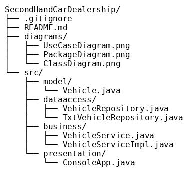
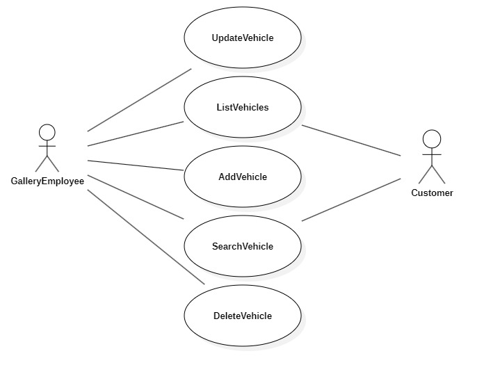
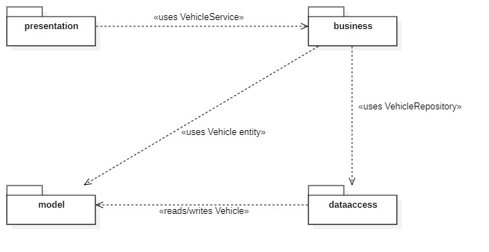
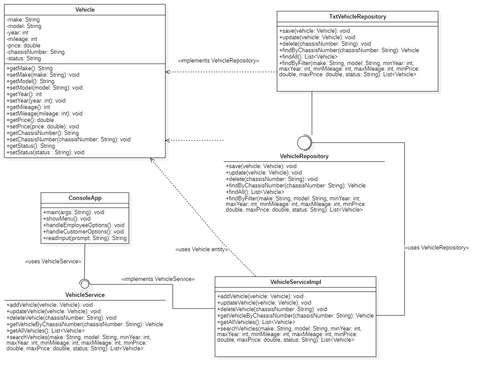

# SecondHandCarDealership

A console-based Java application for buying and selling used cars, using a text file for data storage.

## 1. Project Overview
This project manages a second-hand car gallery via a console interface. It supports two types of users:
- **Gallery Employee**: Can add, update, delete, list, and search vehicles.
- **Customer**: Can view and search vehicles.

Data is stored in a plain text file (`car.txt`) in CSV format. Each record represents a vehicle with the following fields:
- **status** can be either `in_stock` or `sold`.

## 2. Project Structure

- **model**
    - `Vehicle.java`: Represents a vehicle entity (make, model, year, mileage, price, chassis number, status).

- **dataaccess**
    - `VehicleRepository.java`: Interface defining CRUD and search operations for vehicles.
    - `TxtVehicleRepository.java`: Concrete implementation that reads/writes vehicle records from/to `car.txt`.

- **business**
    - `VehicleService.java`: Interface defining business operations (e.g., validation and forwarding calls to data access).
    - `VehicleServiceImpl.java`: Implements business rules and calls `VehicleRepository`.

- **presentation**
    - `ConsoleApp.java`: Main console application. Presents menus, reads user input, and invokes `VehicleService`.

- **diagrams/**  
  Contains exported UML diagrams:
    - `UseCaseDiagram.png`
    - `PackageDiagram.png`
    - `ClassDiagram.png`

## 3. Requirements

- Java 8 or higher
- Git
- (Optional) Maven or Gradle if you wish to manage dependencies
- StarUML 6.3.2 (for editing UML diagrams)

## 4. UML Diagrams

All UML diagrams are stored in the `diagrams/` folder:

### 4.1. Use Case Diagram

### 4.2. Package Diagram

### 4.3. Class Diagram

